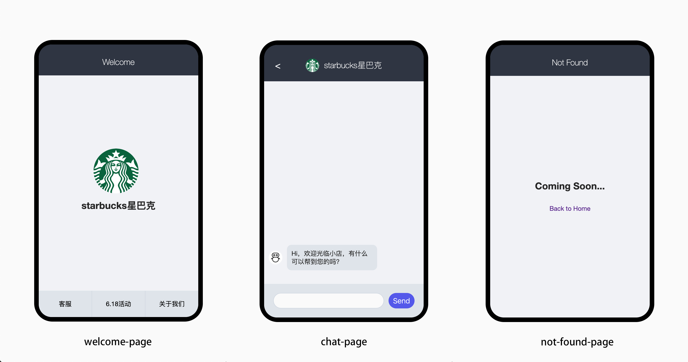
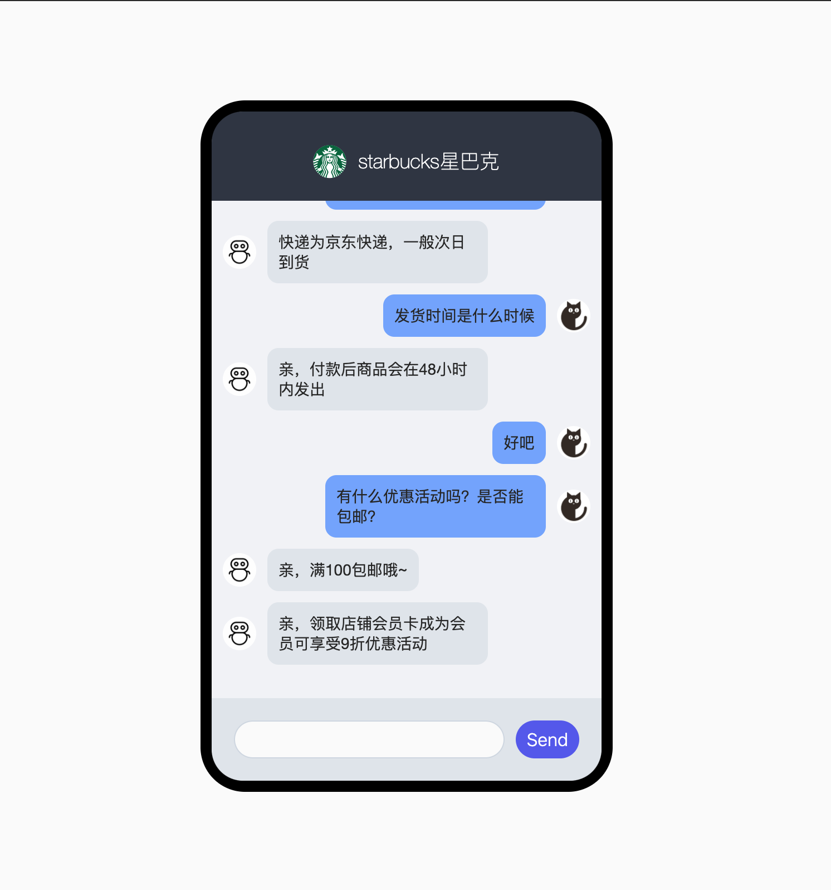

# Setup

## Start Server

Server started at http://localhost:1234 . Parcel is used for bundler.

```
yarn start
```

## React Router Homework Requirements



### 说明

- [欢迎页]，见 mockup 中 welcome-page
- [客服页]，见 mockup 中 chat-page
- [404 页]，见 mockup 中 not-found-page

### 需求列表

1. 添加"欢迎页"，应用默认路由到"欢迎页"
2. "欢迎页"显示商铺 shop 的 logo 和 title
3. "欢迎页"footer 中添加页面导航
4. 当在"欢迎页"导航中点击"客服"时，跳转到"客服页"
5. 客服页 header 中添加 back 按钮，见图（图标的 code 可查看[Get HTML Code](https://www.toptal.com/designers/htmlarrows/)）
6. 当在"欢迎页"导航中点击"6.18 活动"或"关于我们"时，跳转到"404 页"
7. 在"404 页"点击"Back to Home"，返回到"欢迎页"

## React Components Homework Requirements



_需求列表：_

1. 用户输入聊天信息，点击"Send"按钮，可以在对话窗口显示用户输入内容
2. 若用户输入信息能够匹配系统预设好关键字，则系统自动回复，并在对话窗口显示系统自动回复内容
3. 若用户输入信息不能匹配，则无回复

_提示：_

1. 预设问题在 src/data/answers.json 文件中查看，关键字存储在"tags"中，例如`"tags": [ "发货时间" ]`
2. `"tags": [ "DEFAULT" ]`为系统默认回答
3. 系统有两个角色，`ROBOT`和`CUSTOMER`，分别指代系统和用户两个角色，在 src/constants.js 中存取
